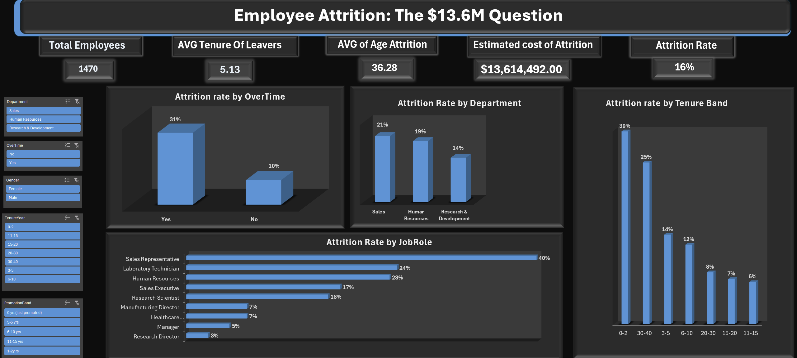

# Employee Attrition Intelligence Dashboard

**Role:** Business Analyst | **Tool:** Microsoft Excel (Power Query, Pivot Tables, Calculated Fields)
**Dataset:** [IBM HR Analytics Employee Attrition Dataset — Kaggle](https://www.kaggle.com/datasets/pavansubhasht/ibm-hr-analytics-attrition-dataset) (1,470 employees, HR & workforce data)

---

## Business scenario

Acting as a Business Analyst supporting HR leadership, I was asked by the CHRO to answer a pressing question ahead of a budget planning cycle:

> *"Attrition is rising and it's costing us money we can't fully account for. Which employee segments are leaving at the highest rate, why are they leaving, and where should we prioritize retention investment over the next two quarters?"*

This project simulates that stakeholder brief end-to-end — from raw employee data through to a decision-ready dashboard with a quantified business case.

---

## Objective

Turn a raw employee HR dataset into a clean, KPI-driven dashboard that identifies the highest-risk attrition segments, surfaces the underlying drivers, and translates the findings into a dollar-quantified business case for retention spend.

---

## Tools & skills used

- **Power Query** — cleaned raw HR export, corrected data types, removed duplicates
- **Calculated columns** — tenure banding, promotion-recency banding, binary attrition flag for pivot-compatible rate calculations
- **Pivot Tables** — multi-dimensional attrition analysis (Department, JobRole, Gender, Tenure Band, OverTime, Promotion Band)
- **PivotCharts & Slicers** — interactive, filter-connected visualizations across the full dashboard
- **KPI cards & dashboard design** — headline metrics surfaced for a single-screen executive view

---

## KPIs

| Metric | Value |
|---|---|
| Total employees | 1,470 |
| Total attritions | 237 |
| Overall attrition rate | 16% |
| Avg. tenure of leavers | 5.13 years |
| Avg. age of leavers | 36.28 |
| Estimated annual cost of attrition | $13,614,492 |

---

## Business questions, findings & recommendations

### 1. Which segments are leaving at the highest rate?
**Method:** Built attrition-rate pivots across Department, JobRole, and Tenure Band, using a calculated AttritionFlag field (averaged to produce a chart-ready percentage per group).

**Finding:** Sales Representatives attrite at **40%** — more than double the company average, and the sharpest single finding in the dataset. At the department level, Sales (21%) leads HR (19%) and R&D (14%), but the role-level view shows the risk is far more concentrated than department alone suggests.

**Recommendation:** Target retention efforts at the Sales Representative role specifically, rather than the Sales department broadly — a department-wide fix would over-spend on roles that aren't actually at risk.

### 2. What's driving attrition — is it workload?
**Method:** Cross-tabbed attrition rate against OverTime status (Yes/No).

**Finding:** Employees working overtime leave at **31%**, compared to **10%** for those who don't — roughly a 3x gap, the strongest single correlation in the dataset.

**Recommendation:** Prioritize a workload and staffing review in high-overtime teams before investing in broader engagement programs — this is the most actionable lever available.

### 3. When are employees most likely to leave?
**Method:** Banded YearsAtCompany into tenure groups and calculated attrition rate per band.

**Finding:** Attrition peaks at **30%** in the 0–2 year tenure band, then declines steadily (25%, 14%, 12%, 8%, 7%, 6%) — a clear early-tenure "danger zone" rather than a long-term burnout pattern.

**Recommendation:** Invest in structured onboarding and 90-day check-ins for new hires, since this is where the largest single block of attrition risk sits.

### 4. What is attrition actually costing the business?
**Method:** Calculated (leavers × average monthly income of leavers × 12 × replacement-cost multiplier), using a 1x multiplier — the conservative-to-moderate end of the standard 0.5x–2x industry range, chosen since roles span junior to senior levels.

**Finding:** Estimated annual cost of attrition is **$13,614,492**.

**Recommendation:** Present this figure alongside the Sales Representative and overtime findings to justify budget for the two most targeted interventions above — even a 20% improvement in the highest-risk segment would materially offset this cost.

---

## Data quality notes (documented for transparency)

- Tenure and promotion-recency bands were initially built as a single conflated column during development — identified and corrected into two separate, independently-sourced calculated fields before final analysis.
- Attrition rate was initially calculated via a manual formula sitting outside the pivot structure, which broke when charted with slicers — resolved by rebuilding it as a proper averaged calculated field (AttritionFlag) inside the pivot, making it slicer- and chart-compatible.
- Cost-of-attrition multiplier is a stated assumption (1x annual salary), not a company-confirmed figure — disclosed explicitly rather than presented as fact.

---

## Dashboard preview



---

## Repository structure

```
Employee-Attrition-Dashboard/
├── Excel/
│   └── Attrition_Dashboard.xlsx   (includes raw dataset + all analysis)
├── dashboard_screenshot.png
└── README.md
```

**Note:** the raw dataset is embedded as a sheet within the Excel workbook itself, rather than provided as a separate CSV.

---

## Scope & limitations

- Dataset includes **voluntary attrition only** — involuntary terminations and retirements aren't distinguished
- Single time-period snapshot — no trend-over-time analysis possible
- Findings reflect **correlation, not proven causation** (e.g., overtime and attrition are strongly linked, but the dataset can't confirm workload directly causes departure)

---

## Key takeaway

This project reflects a full BA workflow: framing a vague leadership concern into precise, quantified business questions; cleaning and correcting real analytical errors along the way rather than hiding them; and delivering a dashboard that ties every finding to a specific, costed recommendation rather than just presenting charts.
